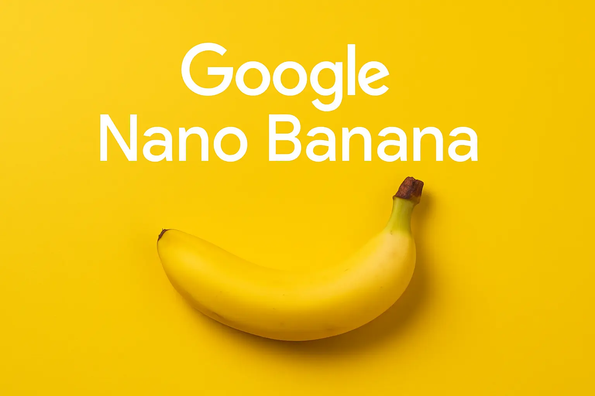

# 👗🕶️ Virtual Try-On Assistant

<div align="center">  
    
</div>  

---

## ✨ Overview

The **Virtual Try-On Assistant** allows users to upload their own photo and instantly try on outfits, glasses, earrings, hats, or other fashion accessories — without stepping into a store.

Built using **Google DeepMind’s Gemini 2.5 Flash Image (Nano Banana) model**, it preserves the user’s **face, hairstyle, expressions, and skin tone**, while realistically overlaying clothing and accessories.

<div align="center">
  
</div>

**Use Cases:**

* 🛍️ **E-commerce & Fashion Retail** – Boost engagement and reduce returns
* 🎨 **Design & Styling** – Preview outfit combinations before committing
* 👤 **Personal Use** – Experiment with looks instantly

---

## 🚀 Features

* Upload your **photo** as the base image
* Upload **multiple outfit/accessory images** (glasses, jackets, jewelry, etc.)
* Realistic rendering powered by **Gemini 2.5 Flash Image**
* Preserves **identity & natural look** (no distortion of face/skin tone)
* Responsive **Next.js frontend** for seamless user interaction

---

## 🛠️ Tech Stack

* **Frontend:** React, Next.js, Tailwind CSS
* **Backend:** Node.js
* **AI Model:** Google Gemini 2.5 Flash Image (Nano Banana)

---

## ⚡ Run Locally

### Prerequisites

* [Node.js](https://nodejs.org/) (v18+)
* A valid `GEMINI_API_KEY` from [Google AI Studio](https://ai.google.dev/)

### Setup Steps

1. **Clone the repository**

   ```bash
   git clone https://github.com/your-username/virtual-tryon-assistant.git
   cd virtual-tryon-assistant
   ```

2. **Install dependencies**

   ```bash
   npm install
   ```

3. **Configure environment variables**
   Create a `.env.local` file and add your API key:

   ```env
   GEMINI_API_KEY=your_api_key_here
   ```

4. **Run the development server**

   ```bash
   npm run dev
   ```

5. **Access the app**
   Open [http://localhost:3000](http://localhost:3000) in your browser.

---

## 🌐 Deployment

You can deploy this project easily using:

* **Vercel** (recommended for Next.js)
* **AI Studio** – [View App](https://ai.studio/apps/drive/1EL-Xl5WMBOLEKrrTFNhIaJwbWP4gTsQN)

---

## 🤝 Contributing

Special thanks to the **Google Gemini team** for enabling next-generation AI experiences in fashion and beyond.
